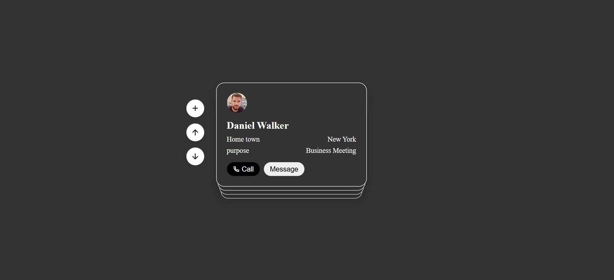
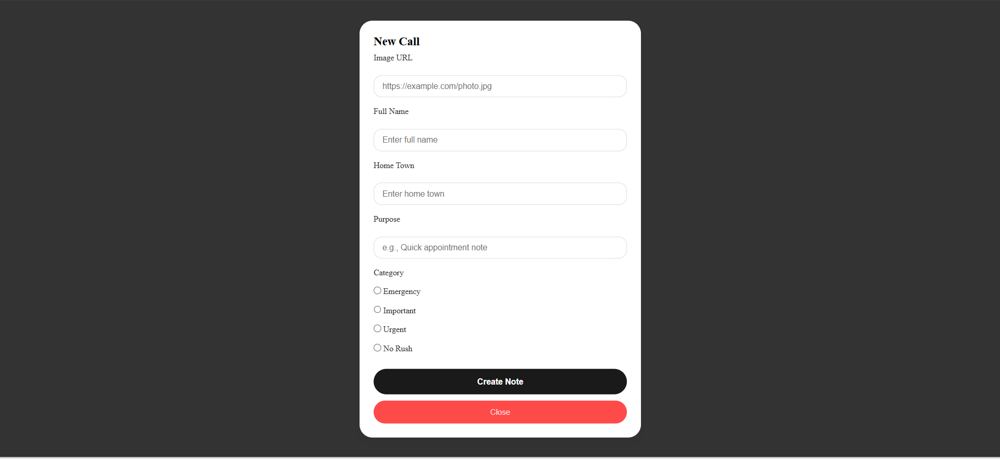

# 📇 Card Manager

A simple **Card Manager** web application built with **HTML, CSS, and JavaScript**. Users can create and manage contact cards, which are stored in the browser using Local Storage.

## ✨ Features

- ➕ Add new contact cards
- 🖼️ Add profile image using an image URL
- 🏠 Store hometown information
- 📝 Add purpose/details
- 💾 Persistent storage using Local Storage
- 📚 Dynamic card generation with JavaScript
- 🔄 Navigate through cards using Up and Down controls
- ✅ Form validation for required fields

## 🛠️ Built With

- HTML5
- CSS3
- JavaScript (ES6)
- DOM Manipulation
- Local Storage API

## 📂 Project Structure

```
Card-Manager/
│
├── index.html
├── style.css
├── call-app.js
└── README.md
```

## 🚀 Getting Started

1. Clone the repository:


git clone https://github.com/mahika300/Card-Manager.git


2. Open the project folder.

3. Open index.html in your browser.

## 📸 Preview






## 🔮 Future Improvements

- 🔍 Search cards
- 🗑️ Delete cards
- ✏️ Edit existing cards
- 🎯 Filter cards by category
- 📱 Improved responsive design

## 👩‍💻 Author

**Mahika Sharma**

- GitHub: https://github.com/mahika300
- LinkedIn: https://www.linkedin.com/in/mahika-sharma-a86246307/